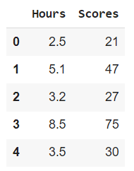
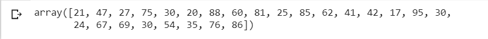
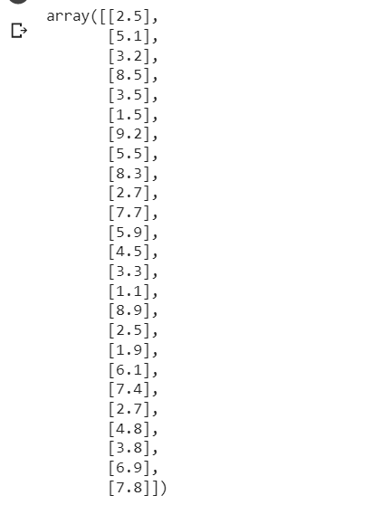
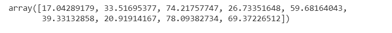
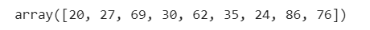
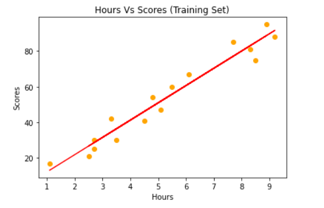
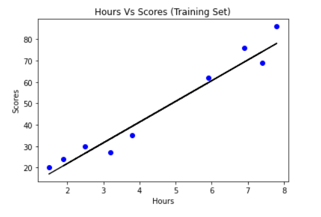
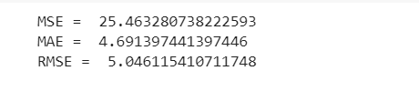

# Implementation-of-Simple-Linear-Regression-Model-for-Predicting-the-Marks-Scored

## AIM:
To write a program to predict the marks scored by a student using the simple linear regression model.

## Equipments Required:
1. Hardware – PCs
2. Anaconda – Python 3.7 Installation / Jupyter notebook

## Algorithm
```
1.Import the needed packages
2.Assigning hours To X and Scores to Y
3.Plot the scatter plot
4.Use mse,rmse,mae formmula to find 
 ```

## Program:
```
/*
Program to implement the simple linear regression model for predicting the marks scored.
Developed by: Swetha.S
RegisterNumber: 212221040169 
*/
```
```
import pandas as pd
import numpy as np
import matplotlib.pyplot as plt
from sklearn.metrics import mean_absolute_error,mean_squared_error
df=pd.read_csv('/content/student_scores.csv')

df.head()
Y=df.iloc[:,1].values
Y
X=df.iloc[:,:-1].values
X
from sklearn.model_selection import train_test_split
X_train,X_test,Y_train,Y_test=train_test_split(X,Y,test_size=1/3,random_state=0)
from sklearn.linear_model import LinearRegression
regressor=LinearRegression()
regressor.fit(X_train,Y_train)
Y_pred=regressor.predict(X_test)
Y_pred
Y_test
plt.scatter(X_train,Y_train,color="orange")
plt.plot(X_train,regressor.predict(X_train),color="red")
plt.title("Hours Vs Scores (Training Set)")
plt.xlabel("Hours")
plt.ylabel("Scores")
plt.show()
plt.scatter(X_test,Y_test,color="blue")
plt.plot(X_test,regressor.predict(X_test),color="black")
plt.title("Hours Vs Scores (Training Set)")
plt.xlabel("Hours")
plt.ylabel("Scores")
plt.show()
mse=mean_squared_error(Y_test,Y_pred)
print('MSE = ',mse)

mae=mean_absolute_error(Y_test,Y_pred)
print('MAE = ',mae)

rmse=np.sqrt(mse)
print("RMSE = ",rmse)
```

## Output:

















## Result:
Thus the program to implement the simple linear regression model for predicting the marks scored is written and verified using python programming.
